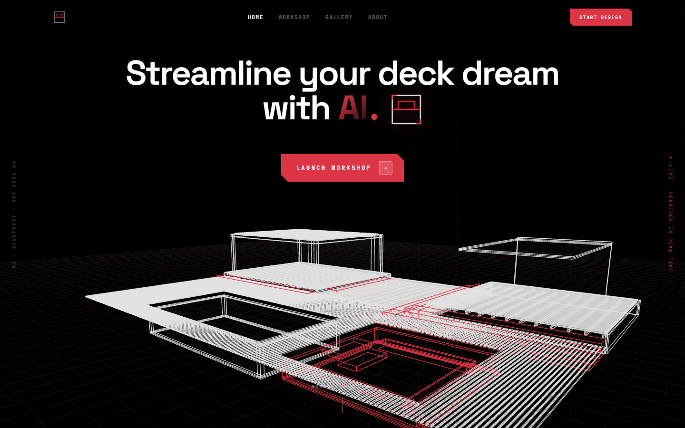
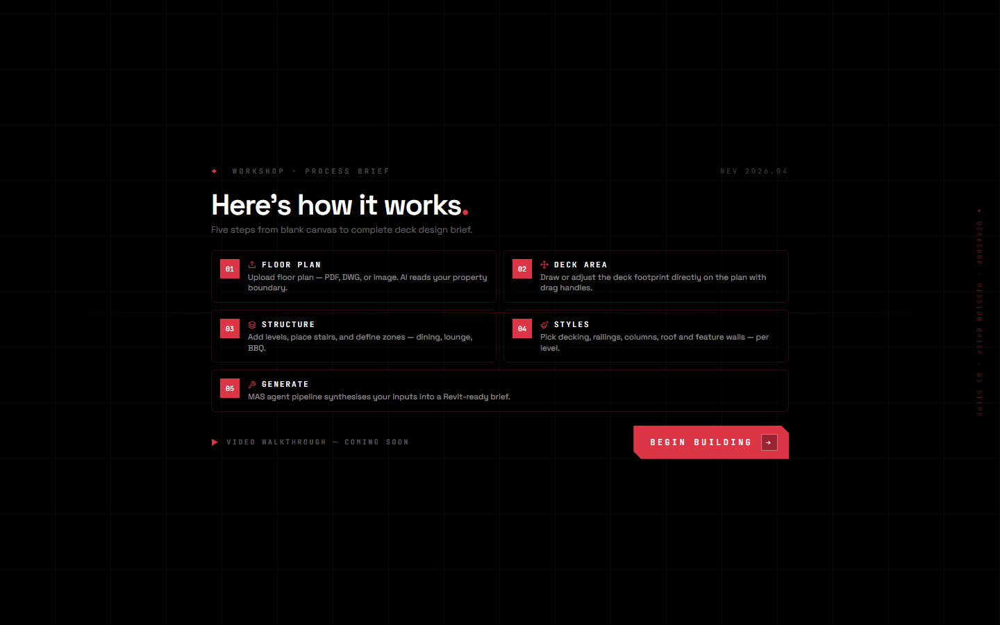
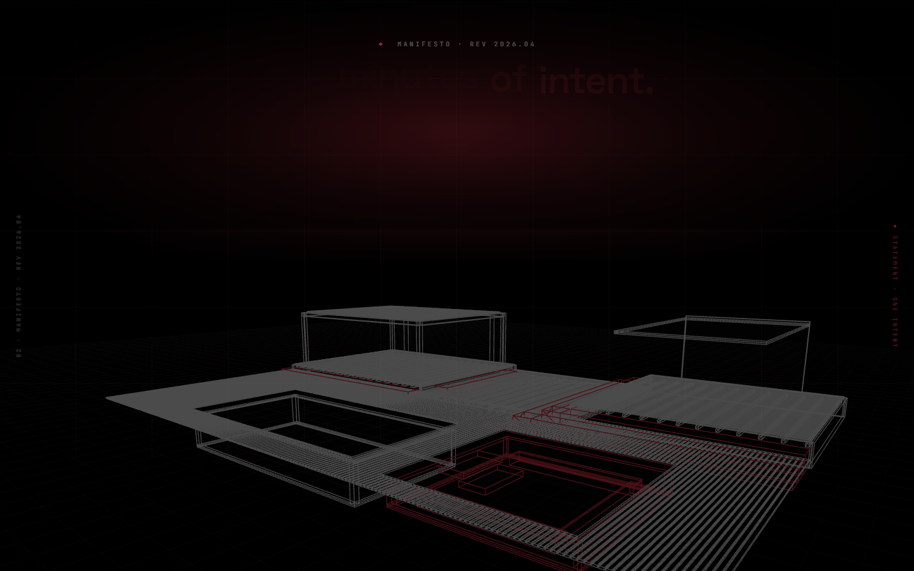
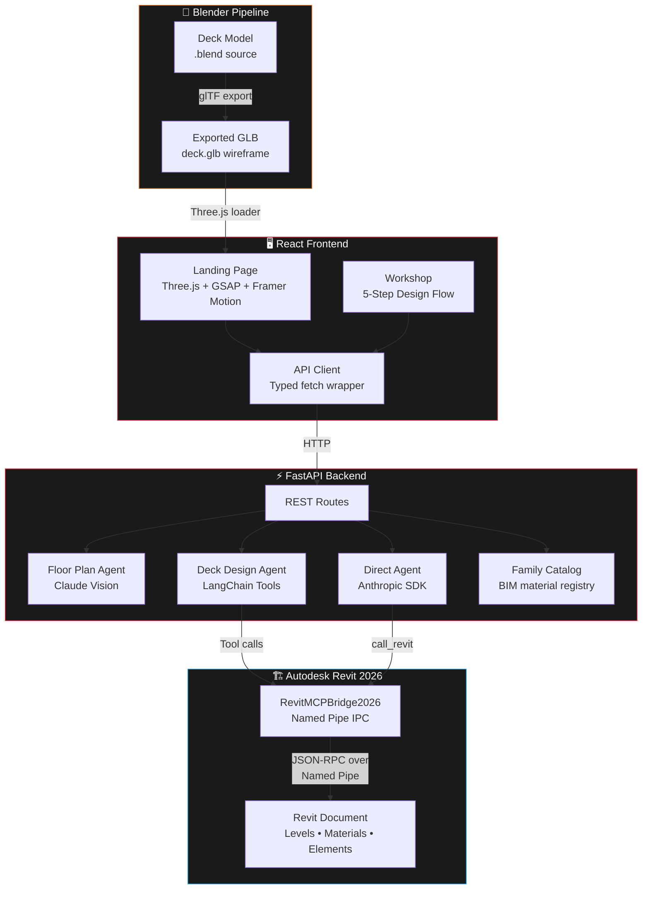
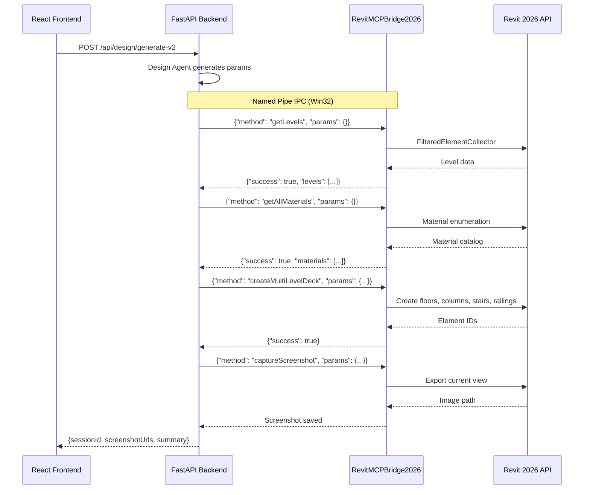
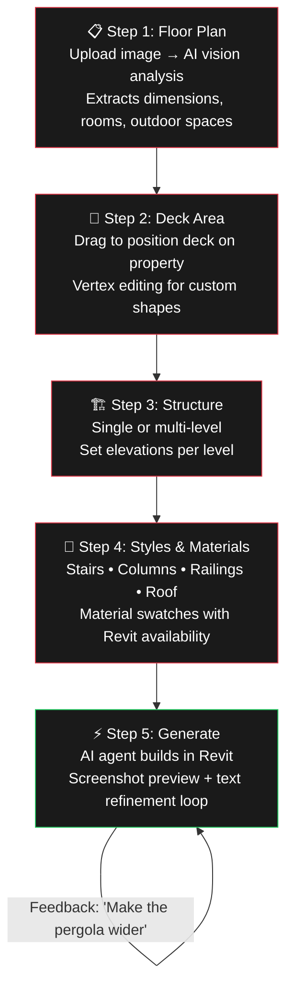
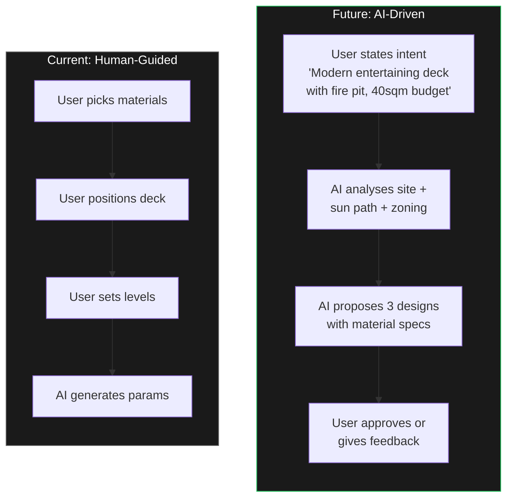

<div align="center">

# DeckForge

### **Weeks of drafting → Minutes of intent.**

A Multi-Agent System that turns a floor plan and a few design choices into a fully parametric Revit deck — automatically.

[](https://python.org)
[](https://react.dev)
[](https://fastapi.tiangolo.com)
[](https://anthropic.com)
[](https://www.autodesk.com/products/revit)
[](https://threejs.org)

</div>

---

## The Problem

Designing a residential deck today is painfully slow:

| Traditional Workflow | Time |
|---|---|
| Client brief + site visit | 1–2 days |
| Drafting in Revit / AutoCAD | 3–5 days |
| Material research + specification | 1–2 days |
| Revision cycles (×3 avg.) | 1–2 weeks |
| **Total** | **3–4 weeks** |

> Most of that time is spent on repetitive parametric work that an AI agent can do in seconds.

**DeckForge compresses the entire workflow into a single sitting.** Upload a floor plan, pick your materials, and watch a crew of AI agents generate a fully parametric Revit model — with stairs, railings, columns, pergolas, and BIM-ready material assignments.

---

## Demo

<!-- Replace with actual screenshots/recordings from your running app -->

### Landing Page — Interactive 3D Blender Model
> The hero features a real-time Three.js scene rendering a Blender-exported deck wireframe (`.glb`). Edges animate in phased groups — structure in white, stairs and fire pit in red — then hand off to OrbitControls for user interaction.



### Workshop — 5-Step Design Flow
> Upload → Position → Structure → Style → Generate. Each step feeds the next. The AI agents handle everything from floor plan vision analysis to Revit parameter generation.



### Revit Output — Parametric BIM Model
> The final output is a real Revit model with proper levels, materials, structural columns, railings, stairs, and optional pergola — all built via the Revit MCP Bridge.



> **Screenshots:** Drop your app screenshots into `docs/images/` as `hero.png`, `workshop.png`, and `revit.png`.

---

## Architecture



---

## The Multi-Agent System (MAS)

Three specialist AI agents, each owning a discipline:

```mermaid
flowchart LR
    subgraph Agent1["🔍 Vision Agent"]
        direction TB
        V1[Claude Sonnet 4 Vision]
        V2[Floor plan image → base64]
        V3[Extract rooms, dimensions,<br/>outdoor spaces, deck suggestions]
    end

    subgraph Agent2["📐 Design Agent"]
        direction TB
        D1[LangChain Tool-Calling Agent]
        D2[Queries Revit for materials,<br/>levels, stair types, railings]
        D3[Generates createMultiLevelDeck<br/>JSON parameters]
    end

    subgraph Agent3["🔧 Build Agent"]
        direction TB
        B1[Direct Anthropic SDK]
        B2[Executes Revit MCP commands]
        B3[Creates floors, columns,<br/>stairs, railings, pergola]
    end

    Agent1 -->|Property analysis +<br/>deck placement| Agent2
    Agent2 -->|Revit-ready params| Agent3
    Agent3 -->|Screenshot URLs| RESULT[🖼️ Result + Refinement Loop]

    style Agent1 fill:#1a1a1a,stroke:#DC3545,color:#fff
    style Agent2 fill:#1a1a1a,stroke:#DC3545,color:#fff
    style Agent3 fill:#1a1a1a,stroke:#DC3545,color:#fff
    style RESULT fill:#1a1a1a,stroke:#22c55e,color:#fff
```



### Agent Details

| Agent | Model | Framework | Role |
|---|---|---|---|
| **Floor Plan Vision** | Claude Sonnet 4 | LangChain + `ChatAnthropic` | Analyses uploaded floor plan images. Extracts property dimensions, room layout, outdoor spaces. Suggests optimal deck placement with reasoning. |
| **Deck Design** | Claude Sonnet 4 | LangChain `AgentExecutor` + Tools | Queries Revit for available materials, levels, stair/railing types. Generates precise `createMultiLevelDeck` JSON parameters. Falls back to deterministic generation if agent fails. |
| **Build & Refine** | Claude Sonnet 4 | Anthropic SDK (direct) | Takes user text feedback + current params. Refines geometry, materials, and connections. Triggers Revit rebuild + screenshot capture loop. |

---

## Revit MCP Bridge — How It Works

The backend talks to Autodesk Revit via a **Named Pipe IPC** channel (`\\.\pipe\RevitMCPBridge2026`). This is a custom Revit add-in that exposes Revit's API as JSON-RPC commands.



### Available MCP Commands

| Command | Description |
|---|---|
| `getLevels` | Fetch all levels from active document |
| `getAllMaterials` | Enumerate the full material library |
| `getMaterialByName` | Find a specific material by name |
| `getStairTypes` | List available stair type families |
| `getRailingTypes` | List available railing type families |
| `loadFamily` | Load a `.rfa` family file into the project |
| `createMultiLevelDeck` | **Core command** — builds the entire deck from tier/connection/pergola params |
| `setElementMaterial` | Apply a material to an element |
| `getElements` | Query elements by category |
| `deleteElements` | Remove elements (used before rebuild) |
| `captureScreenshot` | Export a view as an image |

---

## Blender → Three.js Pipeline

The landing page features an interactive 3D deck model, not a static image.

```
Blender (.blend)
    │
    ├── Model groups: DeckStructure, DeckPool, DeckStairs, DeckPit
    ├── Wireframe geometry with semantic node names
    │
    └── Export as glTF Binary (.glb)
            │
            └── /frontend/public/models/deck.glb
                    │
                    └── Three.js (@react-three/fiber)
                            │
                            ├── Phase 1 (0.0–2.5s): Structure edges fade in (white)
                            ├── Phase 2 (2.0–4.0s): Pool edges fade in (white)
                            ├── Phase 3 (2.8–4.8s): Stairs fade in (RED #DC3545)
                            ├── Phase 4 (3.5–5.5s): Fire pit fades in (RED)
                            └── Phase 5 (6.0s+):    OrbitControls — user interaction
```

The model persists across sections using `position: fixed` with GSAP ScrollTrigger managing opacity and visibility locks — the 3D scene lives exclusively between the Hero and Manifesto sections.

---

## Workshop — The 5-Step Design Flow



### What happens at each step:

**Step 1 — Floor Plan Upload**
- User uploads a floor plan image (JPG/PNG)
- Claude Sonnet 4 Vision agent analyses the image
- Outputs: property dimensions (m), room positions (%), outdoor spaces, deck placement suggestions with reasoning

**Step 2 — Deck Area Positioning**
- Interactive canvas overlay on the property outline
- Drag to reposition, resize handles for dimensions
- Optional vertex editing for non-rectangular deck shapes

**Step 3 — Structure Configuration**
- Choose single-level or multi-level
- Named levels with custom elevations (ft)
- Templates: Single, Split Level, Cascade, Fire Pit Retreat, Pergola & Lounge, Full Estate

**Step 4 — Styles & Materials**
- **Stairs**: Cascading, Standard, Floating, Wrap-Around
- **Columns**: Chamfered, Doric, Metal Clad, Rectangular, Round, Wood Timber
- **Railings**: ULTRALOX Pipe, Glass Balustrade, Wire Tension, Vinyl Classic
- **Roof**: Open Sky, Insulated Panel, Louvred Pergola, Slanted, Gable
- Live Revit material availability checking per column style

**Step 5 — Generate & Refine**
- AI design agent generates Revit parameters
- Builds the deck in Revit via MCP Bridge
- Screenshot capture and preview
- **Natural language refinement**: _"Make the upper deck wider"_ → agent modifies params → Revit rebuilds → new screenshots

---

## Tech Stack

| Layer | Technology | Purpose |
|---|---|---|
| **Frontend** | React 18 + TypeScript + Vite | SPA with page transitions |
| **Styling** | Tailwind CSS 3.4 | Utility-first dark theme |
| **3D** | Three.js + @react-three/fiber + drei | Interactive Blender model |
| **Animation** | GSAP ScrollTrigger + Framer Motion | Scroll-driven parallax, text cascades |
| **Icons** | Lucide React | Consistent icon system |
| **Backend** | FastAPI + Uvicorn | Async REST API |
| **AI (Vision)** | LangChain + ChatAnthropic | Floor plan image analysis |
| **AI (Design)** | LangChain AgentExecutor + Tools | Revit-aware deck parameter generation |
| **AI (Refine)** | Anthropic SDK (direct) | Text feedback → param modification |
| **BIM** | Autodesk Revit 2026 | Parametric model generation |
| **IPC** | RevitMCPBridge2026 (Named Pipe) | Python ↔ Revit communication |
| **3D Modelling** | Blender → glTF export | Hero section deck wireframe |

---

## Project Structure

```
deck-builder-app/
├── backend/
│   ├── main.py                  # FastAPI routes + session management
│   ├── agent.py                 # Direct Anthropic SDK agent (generate + refine + build)
│   ├── revit_client.py          # Named Pipe IPC to RevitMCPBridge2026
│   ├── family_catalog.py        # BIM family registry (decking, railings, pergolas)
│   ├── requirements.txt         # Python dependencies
│   └── agents/
│       ├── __init__.py
│       ├── floor_plan_agent.py  # Claude Vision — floor plan analysis
│       └── design_agent.py      # LangChain tool-calling agent for Revit
│
├── frontend/
│   ├── package.json
│   ├── public/models/deck.glb   # Blender-exported 3D deck model
│   └── src/
│       ├── App.tsx              # Router + page transitions
│       ├── api.ts               # Typed API client
│       ├── types.ts             # TypeScript interfaces
│       ├── pages/
│       │   ├── Home.tsx         # Landing page (hero, manifesto, process, team, CTA)
│       │   ├── Workshop.tsx     # 5-step design workshop
│       │   ├── Gallery.tsx      # Project showcase
│       │   └── About.tsx        # About page
│       └── components/
│           ├── Hero/
│           │   ├── index.tsx    # Hero layout + scroll animations
│           │   └── HeroScene.tsx # Three.js Blender model renderer
│           ├── ManifestoZoom.tsx # Scroll-driven text cascade
│           ├── Gallery.tsx      # Mosaic tile grid
│           ├── ComponentPreview.tsx
│           ├── MaterialSelector.tsx
│           └── layout/
│               ├── Navbar.tsx
│               └── Footer.tsx
│
└── README.md
```

---

## Getting Started

### Prerequisites

| Requirement | Version | Notes |
|---|---|---|
| **Python** | 3.10+ | Windows only (pywin32 for Named Pipe) |
| **Node.js** | 18+ | Frontend build |
| **Autodesk Revit** | 2026 | With RevitMCPBridge2026 add-in loaded |
| **Anthropic API Key** | — | Claude Sonnet 4 access |

### 1. Clone

```bash
git clone https://github.com/anubhavjetley2424/Agentic-AI-Deck-Builder-Streamliner-Tool.git
cd Agentic-AI-Deck-Builder-Streamliner-Tool/deck-builder-app
```

### 2. Backend

```bash
cd backend
pip install -r requirements.txt

# Set your Anthropic API key
set ANTHROPIC_API_KEY=sk-ant-...

# Start the server
uvicorn main:app --reload --port 8000
```

### 3. Frontend

```bash
cd frontend
npm install
npm run dev
# Opens at http://localhost:5173
```

### 4. Revit

1. Open Autodesk Revit 2026
2. Load the **RevitMCPBridge2026** add-in
3. The backend auto-detects the named pipe connection
4. Verify: `GET http://localhost:8000/api/health` should return `{"status": "ok", "revitConnected": true}`

---

## Future Roadmap

### Giving AI More Design Authority

The current system keeps the human in the loop at every step — the user picks materials, positions the deck, and configures structure. The next evolution shifts design intelligence to the agents:



### Planned Improvements

- **AI-driven design proposals** — Agent analyses site context (sun path, privacy, access points) and proposes complete designs from a single sentence of intent
- **Multi-agent collaboration** — Structural agent validates load paths, material agent optimises cost, aesthetic agent scores visual coherence
- **Blender MCP integration** — Direct Blender automation for photorealistic renders alongside Revit BIM output
- **Cost estimation agent** — Real-time material pricing and labour estimates based on generated geometry
- **Council compliance checker** — Agent cross-references local building codes (setbacks, height limits, balustrade requirements)
- **CrewAI orchestration** — Migrate from sequential agent calls to a full CrewAI pipeline with role-based delegation and memory
- **Real-time collaboration** — Multiple users viewing and editing the same design session via WebSocket
- **Mobile site capture** — Phone camera → LiDAR scan → automatic site model

---

## How It Streamlines Construction Design

| Step | Traditional | DeckForge |
|---|---|---|
| Site analysis | Manual site visit + measurements | AI vision analyses floor plan in seconds |
| Design drafting | Days in Revit / AutoCAD | AI generates params → Revit builds automatically |
| Material specification | Browse catalogues, check availability | Curated catalog with live Revit material matching |
| Client revisions | Redraft → re-export → re-present | _"Make the pergola wider"_ → instant rebuild |
| BIM deliverable | Manual model cleanup | Generated model is already BIM-ready |
| **Total time** | **3–4 weeks** | **Minutes** |

---

## API Reference

| Method | Endpoint | Description |
|---|---|---|
| `GET` | `/api/health` | Health check + Revit connection status |
| `GET` | `/api/catalog` | Full BIM family catalog |
| `GET` | `/api/templates` | Available deck templates |
| `GET` | `/api/revit/status` | Revit connection + base level ID |
| `GET` | `/api/revit/materials` | All Revit materials |
| `GET` | `/api/revit/stair-types` | Available stair types |
| `GET` | `/api/revit/railing-types` | Available railing types |
| `GET` | `/api/revit/column-materials/:style` | Material availability per column style |
| `POST` | `/api/floorplan/analyze` | Upload floor plan → AI vision analysis |
| `POST` | `/api/design/generate-v2` | Generate deck via LangChain agent |
| `POST` | `/api/design/refine-v2` | Refine design with text feedback |
| `POST` | `/api/design/generate` | Generate deck (direct agent) |
| `POST` | `/api/design/refine` | Refine deck (direct agent) |
| `POST` | `/api/photos/upload` | Upload site photos |

---

<div align="center">

**Built with AI agents that understand architecture.**

*DeckForge — from intent to BIM in minutes, not weeks.*

</div>
